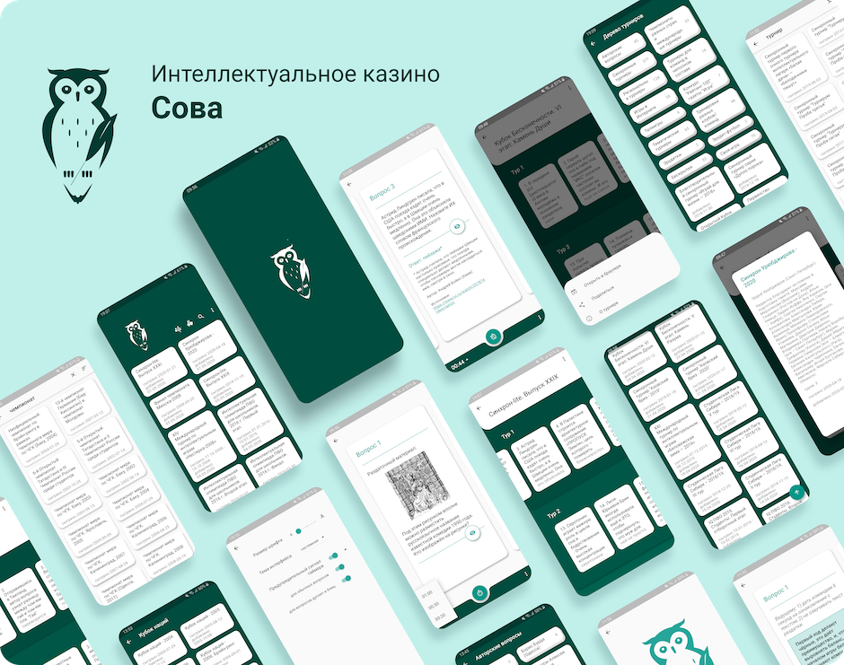
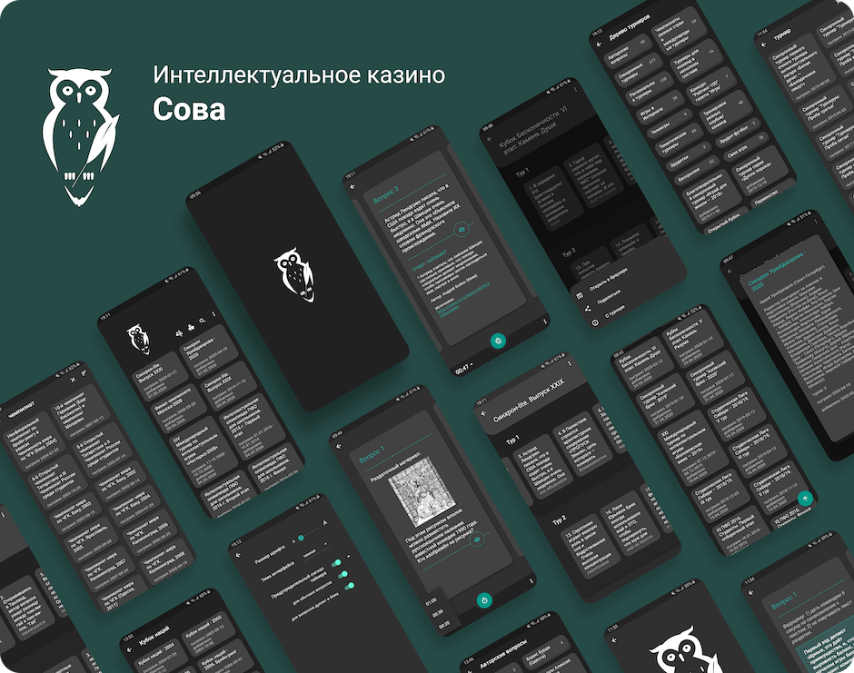

# WWW-flutter

This repository contains source code of the "Sova – What? Where? When?" mobile application - 
an application for fans of the popular show "What? Where? When?”.  

## Screenshots  📷
 

## Features  ✨

* Regular questions database updates;
* Unread tournaments highlighting;
* Bookmarking favorite tournaments;
* Built-in one-minute timer to find an answer;
* Shorter timer for blitz and doublet questions;
* Tournaments search;
* Random questions;
* Tournaments tree;
* Offline access to bookmarked tournaments;
* Dark and light UI themes.

## Future plans 🔮

* Release iOS version;
* Adaptive layout for phones and tablets.

## Author  👩‍💻

Created with [Flutter](https://flutter.dev/) by [Anna (Domashych) Leushchenko](https://foxanna.github.io/)

## License  ⚖️
Protected by "Doom Source Licence". 

You can use the software, but have no ownership thereof. Portions of the source may be used to develop new software; this is referred to as 'Educational Use'. Otherwise, you may not make any commercial gain from it. You can't distribute the source or software. You can't rent or sell the software. The copyright holders may not be held liable for anything & retain all copyright.
